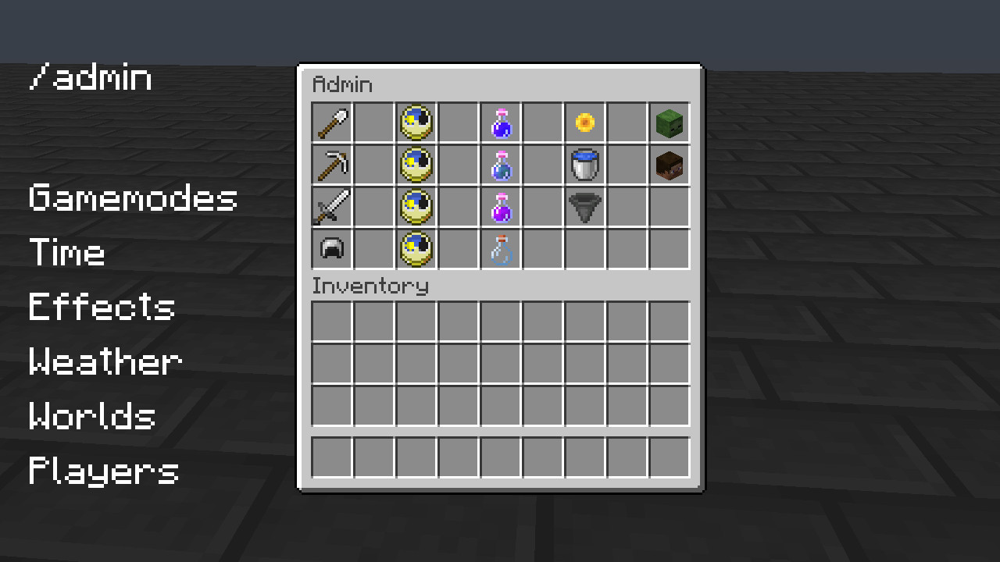
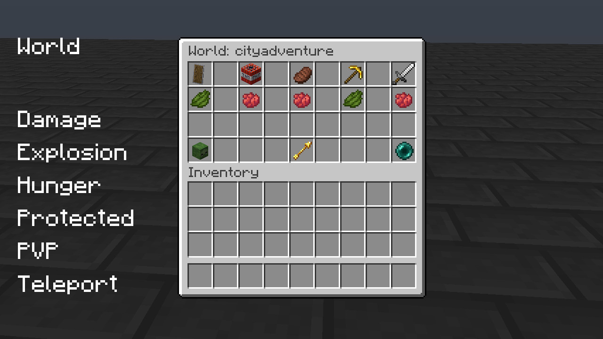
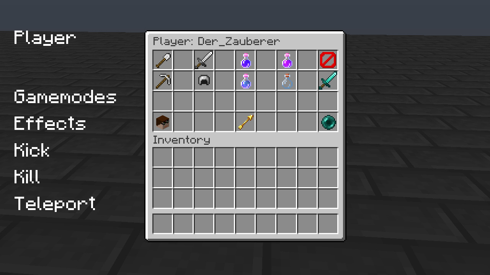
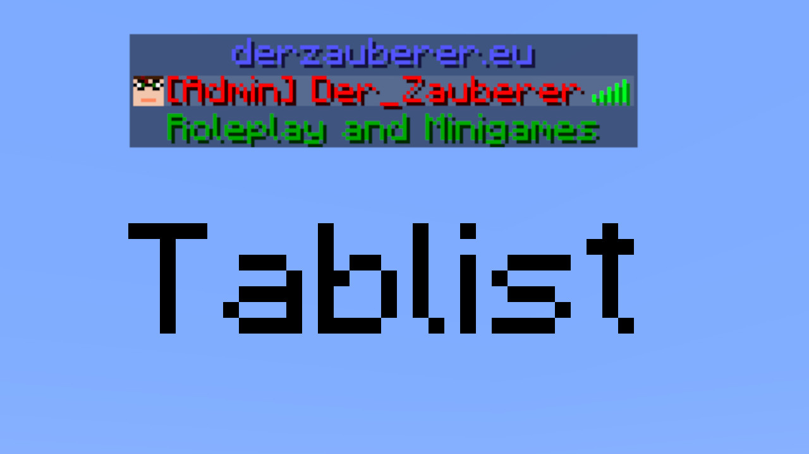
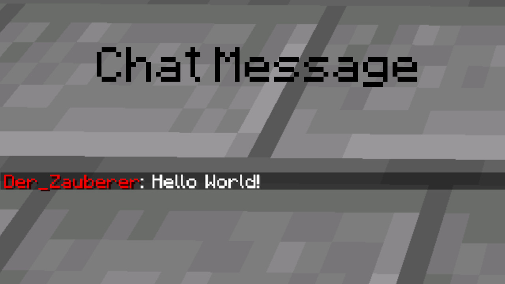

# ServerSystemPlugin

This is a Bukkit/Spigot plugin for permissions, multiworld features and other admin features.

## Features

- /admin command for sever and player settings
- /inventory command for seeing others inventories
- /enderchest command for seeing others enderchest
- Protect worlds from grieving
- Set a position as lobby
- Vanish 
- Player groups with permissions (like PermissinsEx)
- Colored names in tablist and chat
- Different inventories in each world with the WorldGroupSystem or same inventories for specific worlds

## Develpement and Version

API Version: *1.17.x*<br>
Plugin Version: *v2.4*<br>
Java Class Version: *52 (Java8)*<br>

## Commands

|Command|Usage|Permission|Default Permission|Description|
|---|---|---|---|---|
|admin|`/admin`|`serversystem.command.admin`|false|Open the admin menu|
|build|`/build [<player>]`|`serversystem.command.build`|false|Allow the player to build in protected worlds|
|enderchest|`/enderchest [<player>]`|`serversystem.command.enderchest`|false|Open the enderchest of a player|
|inventory|`/inventory [<player>]`|`serversystem.command.inventory`|false|Open the inventory of a player|
|lobby|`/lobby`|`serversystem.command.lobby`|true|Teleport player to lobby|
|permission|`/permission [<player>] [<group>]`|`serversystem.command.permission`|false|Set the permissions of a player|
|vanish|`/vanish [<player>]`|`serversystem.command.vanish`|false|Allow the player to vanish|
|warp|`[/warp <warp>] [<action>] [<option>] [value]`|`serversystem.command.warp` `serversystem.command.warp.edit`|true|Teleport player to a location|
|world|`/world [<world>] [<action>] [<option>] [value]`|`serversystem.command.world` `serversystem.command.world.edit`|false|Teleport player to an other world or edit an other world|
|wtp|`/wtp [<world>]`|`serversystem.command.wtp`|false|Teleport player to an other world|

The commands `world` and `warp` can be used to teleport with `serversystem.command.world` and `serversystem.command.warp`. The edit the warps and worlds use the same command, but with the permissions `serversystem.command.world` and `serversystem.command.warp`.

## Permissions
|Permission|Default|Description|
|---|---|---|
|`serversystem.command.admin`|op|Open the admin inventory|
|`serversystem.command.build`|op|Allow the player to build in protected worlds|
|`serversystem.command.enderchest`|op|Open the enderchest of a player|
|`serversystem.command.inventory`|op|Open the inventory of a player|
|`serversystem.command.lobby`|true|Teleport player to lobby|
|`serversystem.command.permission`|false|Set the permissions of a player|
|`serversystem.command.vanish`|op|Allow the player to vanish|
|`serversystem.command.warp`|op|Teleport player to a location|
|`serversystem.command.world`|op|Teleoprt player to other teleport player to an other world or edit an other world|
|`serversystem.command.wtp`|op|Teleoprt player to other teleport player to an other world|
|`serversystem.tools.adminstar`|op|Open the admin inventory|
|`serversystem.tools.commandblock`|false|Allow to use commandblocks|
|`serversystem.tools.disabledblocks`|op|Allow to use in the config disabled blocks|
|`serversystem.tools.signeddit`|op|Allow to create executable signs|

## Signs
You can create teleport signs to a world or warp. As long as you have the permissions `serversystem.tools.signeddit` you can create a such a sign. Make sure, that the label is in the second line and the name of the world or warp is in the third!

```
 [World]
worldname
```

```
 [Warp]
warpname
```

## Config
The config can be found at `/plugins/serversystem/plugin.yml` in your server folder.

### Disable join- and leavemessage
You have the oportunity to disable the join- and leavemessage if you don't want to have minecraft's default join- and leavemessage.

```json
Server:
  joinmessage: false
  leavemessage: false
```

### Tablist text
You can add text above and below the names of the players in the tablist.

```json
Server:
  tablist:
    title:
      text: Welcome
      color: blue
    subtitle:
      text: to this server!
      color: dark_green
```

You can use the colors codes listed in the [Minecraft Wiki](https://minecraft.gamepedia.com/Formatting_codes#Color_codes "Color Codes").

### Lobby
You can set the lobby as main world of teh server. You can go back by `/lobby` if you have this enabled and if a user is connecting to the server, he will be spawn at the lobby world.

```json
Server:
  lobby: true
  lobbyworld: world
```

### Enable WorldGroups
If you want to use multible worlds with different inventories and spawn locations, you can use the WorldGroup-System. It works simular to the plugin MultiWorld. You can enable this feature in the here:

```json
Server:
  enableworldgroups: true
```

Every world, which is loaded has a configuration section. There can the option `group` be found. Worlds are in one worldgroup if they have the same group name. When a player switch to a world in the same worldgroup, he will keep his inventory and levels. If the world have a groupname, which no other world have, then the world is alone in a worldgroup and have a separated inventory and experience level.

```json
world:
    group: world
world_nether:
    group: world
hogwarts:
    group: hogwarts
```

In this example world and world_nether are in the same worldgroup while the world hogwarts has his own separated worldgroup.

### Enable Portals
The Nether-Portal and the End-Portal are enabled by default, you can disable those with:

```json
Server:
  enableportals: false
```

### Disable commands and default permissions
You can disable permissions simply by adding the permission to the list. For example, you can disable minecraft default commands by adding its permission. Disabled permissions will be removed for each group, even they would get the permission, disabled permissions are overwriting the group permissions! Permissions can't be shortet by using a `*`!

```json
DisabledPermissions:
- bukkit.command.version
- bukkit.command.plugins
- bukkit.command.help
```

You can find minecraft standard commands in the [Bukkit Wiki](https://bukkit.gamepedia.com/CraftBukkit_Commands "Commands").

### Load worlds
You can load other worlds to your server, if there in your server directory. You can add a new world just by adding the world to the list. The world 'world' and the subworlds 'world_nether' and 'world_the_end' are loaded by default. You can change the default world in the file `server.properties`.

```json
Worldload:
- hogwarts
```

### Groups [until v2.1]
The plugin have a permission system. A group have a name, a parent and permissions as a list. If you don't want do use this add nothing to the groups. A group get also all permissions from it's parent.

```json
Groups:
  player: ''
  moderator:
    id: 02RankModerator
    color: dark_blue
    prefix: '[Moderator] '  
    permissions:
    - serversystem.command.permission
    - minecraft.command.*`
    - -bukkit.command.*
  admin:
    id: 01RankAdmin
    color: dark_red
    prefix: '[Admin] '
    parent: moderator
    permissions:
    - minecraft.command.op
    - serversystem.command.*
    - bukkit.command.*
```

Permissions can be shorted with `*` at the end of the string, which means that all permissions will be added, which starts with this prefix. Permissions can also be removed by adding a `-` at the beginning of the string!

The id of the group is unimportant except for the number in front of the name. The number defines the order of the player in the tabbar. The Rank `04RankSupporter` will be displayed below the `01RankAdmin` but above the `06RankPremium` for example. Make sure you have an empty space after the prefix, otherwise the prefix will be displayed directly in front of the player's name. You can find an example for the tabbar at the end of the document as image.

You can use the colors codes listed in the [Minecraft Wiki](https://minecraft.gamepedia.com/Formatting_codes#Color_codes "Color Codes").

You can add a group to the players in the player section. 

```json
Players:
  8e1f0a29-7279-412d-a6a6-4266164d6a87:
    name: Der_Zauberer
    group: admin

```

For versions before v2.1 please look at [the old Documentation](https://github.com/Der-Zauberer/ServerSystemPlugin/blob/a0455d4d48d943d94fcb63ee4aa78ef9d2214c06/README.md)

### Worlds
All loaded worlds have own settings. <br>
`group` defines the worldgroup of the world (more information at "Enable WorldGroups")<br>
`worldspawn` the player will always spawn at worldspawn if this is true, otherwise he would spawn at the last position<br>
`protect` if this is true, blocks can't be removed ore build until the player go in buildmode<br>
`pvp` players cant damaging each other if this is false<br>
`damage` players cant take damage from any source, if this is false<br>
`hunger` if this is false, player do not have to eat<br>
`explotion` explotions can not make damage to blocks, if this is false<br>
`deathmessage` on chat message about a player death will appear, if you disable the deathmessage<br> 
`gamemode` the player will set in this gamemode, if the join to the world for the first time<br>
`permission` the required permission to get to the world (optional)<br>

```json
Worlds:
  world:
    group: world
    worldspawn: false
    protect: true
    pvp: false
    damage: false
    huger: true
    explosion: false
    deathmessage: true
    gamemode: 2
```

### Players
A player is identified by this UUID if he change his name. For easier editing the actual name is save to to config. The existing option is for internal handling. The player can add to a permission group (more information at "Groups").

```json
Players:
  8e1f0a29-7279-412d-a6a6-4266164d6a87:
    name: Der_Zauberer
    group: admin
```

### Example
```json
Server:
  joinmessage: false
  leavemessage: false
  enableworldgroups: false
  title:
    text: 'Welcome'
    color: 'dark_blue'
  subtitle:
    text: 'to this server!'
    color: 'dark_green'
  message:
    prefix: '[Server]'
    prefixcolor: yellow
    color: yellow
    errorcolor: red
  tablist:
    title:
      text: Welcome
      color: blue
    subtitle:
      text: to this server!
      color: dark_green
  lobby: true
  lobbyworld: world
  enableworldgroups: false
DisabledPermissions:
- bukkit.command.version
- bukkit.command.plugins
- bukkit.command.help
Worldload:
- hogwarts
Groups:
  player: ''
  moderator:
    id: 02RankModerator
    color: dark_blue
    prefix: '[Moderator] '  
    permissions:
    - serversystem.command.permission
    - minecraft.command.op
  admin:
    id: 01RankAdmin
    color: dark_red
    prefix: '[Admin] '
    parent: moderator
    permissions:
    - serversystem.tools.commandblock
    - serversystem.command.permission
Worlds:
  world:
    group: world
    worldspawn: true
    protect: true
    pvp: false
    damage: false
    huger: true
    explosion: false
    deathmessage: true
    gamemode: 2
  world_nether:
    group: world
    worldspawn: false
    protect: false
    pvp: true
    damage: true
    huger: true
    explosion: true
    deathmessage: true
    gamemode: 2
  world_the_end:
    group: world
    worldspawn: false
    protect: false
    pvp: true
    damage: true
    huger: true
    explosion: true
    deathmessage: true
    gamemode: 2
  hogwarts:
    group: hogwarts
    worldspawn: false
    protect: true
    pvp: false
    damage: true
    huger: true
    explosion: false
    deathmessage: true
    gamemode: 2
Players:
  8e1f0a29-7279-412d-a6a6-4266164d6a87:
    name: Der_Zauberer
    group: admin
```

## Images






